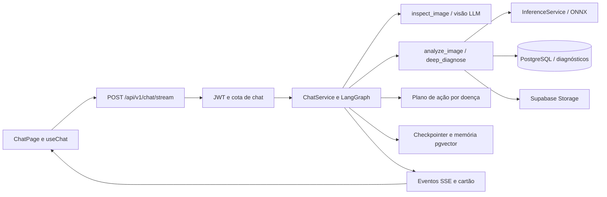

# Zé Praga — auditoria do workspace e preparação de UX/UI para o TCC

Data: 06/09/2026. Escopo: frontend, backend, modelos, integrações, documentação
e condições para uma demonstração. Revisões analisadas: frontend `6b9d775`,
backend `2ddadeb`, model-playground `da11e42`.

## Parecer

O projeto tem uma base técnica substancial: modelos exportados, agente com
ferramentas, memória, autenticação, planos, persistência e uma identidade visual
própria. O backend tem verificações automatizadas fortes. A maior lacuna para a
entrega é a coerência entre o que a interface promete, o que os endpoints fazem
e o que efetivamente foi demonstrado ao usuário.

**Ainda não considero a aplicação pronta para a banca.** Há falhas concretas
de contrato e riscos de apresentar dados simulados como resultados reais. O
primeiro investimento deve ser confiabilidade do fluxo principal, seguido de
hierarquia visual, acessibilidade e ensaio da apresentação.

Esta entrega é uma auditoria e preparação das instruções de desenvolvimento.
O backlog abaixo não está implementado. O código funcional da aplicação não foi
alterado nesta rodada. Foram criados arquivos de orientação para o Codex e
atualizado o grafo de arquitetura.

## Método e limites da validação

- Consultei o Graphify existente e confirmei relações e comportamentos nos fontes.
- O mapa de 16/08 continha funções já removidas. Executei `graphify update .
  --no-cluster` e `graphify cluster-only . --no-label` na raiz do workspace.
- Mapa atualizado: **3.691 nós, 8.246 arestas, 224 comunidades**; extração AST,
  **zero tokens de entrada/saída de APIs de IA**. Backups preservados pelo Graphify.
- A extração bruta informou 9.621 relações; a reconstrução em grafo não dirigido
  consolidou relações. O diagnóstico do JSON final não encontrou endpoints
  pendentes nem self-loops, mas não mede a informação perdida antes do build.
- Nove arquivos produziram zero nós, incluindo arquivos de labels e configurações.
  Documentos, imagens e artigo não tiveram extração semântica nesta atualização.
  O grafo orienta navegação; não certifica cobertura de todos os comportamentos.
- Revisei rotas, temas, páginas, hooks, serviços, domínios, deploy, CI e o pipeline
  de treinamento/exportação. Comparei o artigo Markdown com os artefatos atuais.
- **Não houve inspeção visual em navegador**: a revisão automática bloqueou tanto
  o início do servidor mock quanto a tentativa limitada a `127.0.0.1`, sem razão
  específica além de bloqueio por política. Não contornei o bloqueio.
- Não validei visualmente PDF/PPTX do artigo, dispositivos reais, serviços de
  produção, entregabilidade de e-mail ou classificação ponta a ponta com LLM.
- Valores de credenciais não foram registrados. Presença de configuração não
  significa credencial válida, saldo disponível ou serviço operacional.

## O que foi executado

| Verificação | Resultado observado |
|---|---|
| Frontend: testes com coverage, sem watch, em série | **58 testes / 8 suítes passaram** |
| Frontend: cobertura de linhas | **15,55%**; páginas principais com 0% nessa execução |
| Frontend: build de produção | Passou; bundle principal **473,61 kB gzip** |
| Avisos do build | Sourcemaps ausentes de `@microsoft/fetch-event-source`; caniuse-lite desatualizado |
| Backend: Ruff em `app/ tests/` | Passou |
| Backend: mypy em `app/` | Passou, 128 arquivos de origem |
| Backend: pytest com coverage | **881 passaram, 4 deselected; cobertura 90,98%** |
| Ambiente do pytest | Windows, Python 3.13.14; variáveis obrigatórias de teste |
| Rotas carregadas da aplicação | 37 caminhos distintos, incluindo documentação automática |
| Arquivos ONNX locais | Três arquivos com tamanho real, aproximadamente 70,2 / 94,0 / 343,3 MB decimais |
| Probe do jsPDF + AutoTable instalado | `doc.autoTable` indefinido; export `autoTable` disponível |
| Contraste calculado dos tokens | Branco/terracota ≈ **3,00:1**; verde principal/superfície escura ≈ **1,94:1** |

Testes passam com dependências substituídas em muitos cenários. Esses resultados
não equivalem a um teste de produção. Os ONNX foram verificados por presença e
tamanho nesta rodada; não reexecutei treino nem avaliação das 1.221 imagens.

## Arquitetura que existe hoje

O workspace contém **três repositórios Git independentes**. `artigo/`,
`graphify-out/`, `CLAUDE.md` e `AGENTS.md` da raiz ficam fora deles.

| Parte | Responsabilidade | Arquivos principais |
|---|---|---|
| Frontend | Navegação, chat, upload, histórico, diagnóstico, perfil, planos, docs | `frontend/src/App.js`, `pages/`, `components/`, `hooks/`, `services/` |
| Backend HTTP | JWT/API keys, cotas, validação, domínios e banco | `backend/app/main.py`, `core/dependencies.py`, `domains/` |
| Agente | Escolha de ferramentas, SSE, interrupções, memória e resposta | `domains/chat/service.py`, `agent.py`, `tool_registry.py` |
| Subgrafo | Inferência em lote, plano de ação, evidências e persistência | `domains/diagnosis_graph/` |
| Visão computacional | ONNX por modelo e média de probabilidades do ensemble | `domains/inference/`, `backend/models/` |
| Pesquisa experimental | Preparação, splits, augmentation, treino, métricas, exportação | `model-playground/src/`, `scripts/`, `artifacts/metrics/` |

Fluxo principal confirmado no código:

O caminho REST de integração é `/api/v1/diagnoses/analyze`, com autenticação
JWT ou API key. `/api/v1/inference` também existe. Os domínios incluem auth,
users, diagnoses, action_plans, subscriptions, usage, chat, inference, uploads,
talhoes e transcription. Chat e inferência estão **no backend atual**, apesar
de a abertura do README ainda afirmar que ficam em outro repositório.

A memória tem estado vivo no checkpointer, registro canônico em tabelas e busca
semântica entre sessões. Ferramentas são selecionadas por plano e flags globais.
O frontend recebe a configuração de capacidades em `user.plan.features`.

## Serviços e dependências

| Serviço / tecnologia | Uso encontrado | O que foi ou não confirmado |
|---|---|---|
| Vercel | Hospedagem indicada por `.env.production` e `vercel.json` | Configuração local presente; publicação atual não inspecionada |
| Google Cloud Run | Serviço `ze-praga-api`, região `us-east1` | Origem da API em `.env.production`; runtime remoto não auditado |
| Cloud Build | Build e deploy a partir de commit | `backend/cloudbuild.yaml`; trigger ativo não confirmado |
| Cloud Storage | Bucket dos ONNX durante o build | `gs://ze-praga-tcc-models`; acesso remoto não testado |
| Artifact Registry | Imagens Docker usadas no deploy | Referenciado em `cloudbuild.yaml` |
| GitHub + GitHub Actions + Git LFS | Código, CI e modelos | Workflows e `.gitattributes`; últimas execuções remotas não consultadas |
| Supabase PostgreSQL / pgvector | Dados e memória semântica | Dependências e configuração local presentes; banco remoto não consultado |
| Supabase Storage | Upload e URLs assinadas | Implementado; upload real não exercitado |
| OpenAI | Chat, visão, embeddings e transcrição | Configuração local: GPT-4o-mini / GPT-4o; chave presente, validade não testada |
| LangChain / LangGraph | Orquestração e estados | Bibliotecas locais, não um serviço remoto obrigatório adicional |
| Anthropic / AWS Bedrock | Alternativas suportadas pela factory LLM | Dependências presentes; não são evidência de uso ativo |
| Tavily | Busca web para Pro+ | Tool presente; chave não encontrada no `.env` local auditado |
| SciELO | Busca científica para Enterprise | Tool HTTP presente; resposta JSON real precisa de teste |
| Resend | Verificação de conta e redefinição de senha | Sender implementado; chave não encontrada no `.env` local auditado |
| Google Fonts | Quatro famílias tipográficas externas | Referenciadas em `frontend/public/index.html` |
| WhatsApp | Link de compartilhamento de resumo | `wa.me`, sem integração de envio automático |
| Pagamentos | Troca de plano e checkout demonstrativo | **Sem processador de cobrança**; Pix, cartão e boleto são simulação |
| Docker / PostgreSQL local | Desenvolvimento | Compose usa pgvector; não foi iniciado nesta rodada |

A autenticação é **JWT próprio com bcrypt**, não Supabase Auth. O plano pode
selecionar o modelo LLM e prevalecer sobre o default global. O `.env` local é
de desenvolvimento, com confirmação de e-mail desligada; isso não descreve a
configuração efetiva no Cloud Run.

## Achados priorizados e critérios de aceitação

P0: corrigir antes de apresentar resultados como reais. P1: afeta tarefas
centrais e deve entrar na preparação da demonstração. P2: polimento e sustentação.
Todos os itens abaixo estão **abertos**, salvo indicação explícita em contrário.

### UX-001 — P0 — Inferência pode apresentar resultado aleatório após falha

`backend/app/domains/inference/service.py::predict` captura falhas e chama
`_predict_mock`, que escolhe uma doença aleatória. O resultado usa o mesmo
contrato dos resultados reais. `/api/v1/health` devolve estado fixo e não testa
modelo, banco, Storage ou LLM. Cloud Build verifica tamanho dos ONNX, mas isso
não impede fallback por erro de execução ou bytes inválidos.

Aceite: produção falha de forma explícita quando não há inferência real; modo
demonstrativo identificado na resposta e na UI; readiness informa quais modelos
estão disponíveis; teste de modelo ausente/corrompido não pode produzir diagnóstico
aparentemente real. Não basta mudar o texto da landing.

### UX-002 — P0 — Severidade e explicação têm significado diferente do sugerido

`InferenceService._resolve_meta` usa `severity_default` e descrição do catálogo.
Não há estimativa da área lesionada. A UI mostra “Severa/Moderada/Leve” e
“Como eu cheguei nisso”, mas o texto exibido é uma descrição da doença.

Aceite: separar hipótese de doença, confiança do classificador e informação
geral de manejo. Remover a impressão de severidade medida na foto e de explicação
visual individual até que esses métodos existam e sejam validados.

### UX-003 — P0 — Cache de navegador abrange respostas privadas

`frontend/public/service-worker.js` intercepta todo GET, armazena respostas
bem-sucedidas e usa cache quando a rede falha. Não restringe origem/tipo de recurso,
não exclui API autenticada e o logout não limpa esse cache. Há risco de conteúdo
privado permanecer no dispositivo e ser reutilizado entre sessões, dependendo de
URL e cabeçalhos Vary. Não executei uma prova de vazamento entre contas.

Aceite: cache limitado a assets públicos da aplicação; API e respostas com auth
ficam fora; atualização invalida o cache antigo; teste offline/troca de usuário.
Não exibir promessa de fila offline sem fila implementada.

### UX-004 — P1 — Promessa de acesso anônimo contradiz autenticação

`src/copy/ze.js` promete “Sem cadastro” e “Não precisa de conta pra usar o chat”.
O router real usa `require_quota`, que exige usuário. `/chat` e `/historico` não
têm guard central; perfil tem proteção própria, e pagamento redireciona antes de
considerar a hidratação da sessão. SSE não usa os interceptors do axios.

Aceite: adotar explicitamente o fluxo com conta, preservar destino e foto ao
entrar, mostrar carregamento durante restauração de sessão e tratar 401 tanto em
REST quanto SSE. Não liberar anonimamente o backend apenas para combinar com copy.

### UX-005 — P1 — “Limpar histórico” aparenta sucesso sem apagar no servidor

`src/services/historyService.js::clearAllDiagnoses` faz DELETE sem `confirm=true`.
O backend retorna HTTP 200 com instrução de confirmação e não apaga.
`useHistory.clearAll` interpreta como sucesso e esvazia a lista local; ao recarregar,
os diagnósticos reaparecem. O diálogo de confirmação visual já existe.

Aceite: enviar confirmação somente depois do diálogo, validar o resultado da API,
aguardar conclusão antes de fechar e testar persistência após recarregar.

### UX-006 — P1 — Histórico ignora a paginação do servidor

O backend retorna 20 itens por padrão. `getDiagnoses` descarta `total/page/limit`;
busca, filtros, contagens e exportação trabalham apenas sobre a primeira página.
O contador do perfil usa a mesma lista incompleta.

Aceite: paginação e filtros reais, total do servidor, estado vazio distinto de
“nenhum resultado para este filtro” e indicação clara do escopo da exportação.
Validar com pelo menos 25 diagnósticos em fixture.

### UX-007 — P1 — Exportação PDF do histórico está ligada incorretamente

`HistoryPage.js` importa `jspdf-autotable` só por efeito colateral e chama
`doc.autoTable`. A versão instalada fornece `autoTable(doc, options)`; o auto-registro
depende de jsPDF global em `window`, que a aplicação não configura. O probe local
confirmou que o método da instância fica indefinido.

Aceite: usar export explícito ou registrar plugin deliberadamente; testar geração
com tabela real. Para o PDF individual, `pdfExport.js` precisa de paginação de
textos longos, fontes e plano carregado antes de exportar. Renderizar e conferir
documentos de uma e várias páginas antes da entrega.

### UX-008 — P1 — Recuperação de conversa não recupera o diagnóstico completo

`sessionsService.mapMessage` preserva `diagnosisId`, mas `useChat.loadSession`
define `diagnosis: null`. Fotos, cartões e perguntas pendentes não são reidratados
por esse caminho. O backend tem `/chat/interrupts`, mas esse estado não é buscado
ao reabrir a conversa.

Aceite: reabrir conversa com acesso ao diagnóstico salvo e recuperar a pergunta
pendente, mantendo a possibilidade de responder e continuar após reload.

### UX-009 — P1 — Chat precisa de controle de concorrência e recuperação

`useChat` não mantém AbortController para cancelar ao sair, trocar sessão ou abrir
nova conversa. Os botões de sessão continuam acessíveis durante streaming; callbacks
de um turno antigo podem atualizar `sessionId` depois da troca. Drag/drop não verifica
`isLoading` nem pergunta pendente. O scroll suave é acionado a cada mudança das
mensagens e pode puxar a tela enquanto a pessoa lê conteúdo anterior.

Aceite: cancelar/ignorar callbacks antigos, impedir envios sobrepostos, manter o
rascunho quando há falha, oferecer tentar novamente e só acompanhar o scroll
quando a pessoa está perto do fim. Testar troca de sessão no meio da resposta.

### UX-010 — P1 — Upload e voz têm comportamentos inconsistentes

Foto do composer tem preview; foto do estado inicial, CameraFAB e drag/drop pode
ser enviada imediatamente. Validação de tipo/tamanho não é compartilhada. Falha
de microfone só vai ao console. Gravação não tem descarte explícito nem limpeza
completa de recursos ao desmontar; previews por object URL não são revogados.

Aceite: todos os caminhos abrem a mesma revisão da imagem; JPG/PNG/WebP e limite
de 10 MB são validados antes do envio; erros compreensíveis; gravar, ouvir/revisar,
cancelar e enviar como ações distintas; liberar tracks, timers e object URLs.

### UX-011 — P1 — Plano de ação pode sumir ou ficar associado ao resultado anterior

As telas não apresentam adequadamente erro e ausência do plano retornados pelo
hook. `useActionPlan` não limpa `actionPlan` ao mudar a doença; falha na próxima
consulta pode preservar o plano anterior se o componente for reutilizado. A tela
de detalhe permite exportar antes de a consulta terminar.

Aceite: estado vinculado à doença correta; carregamento, erro com retry, ausência
e conteúdo disponível distinguíveis; exportação informa se o plano está incompleto.

### UX-012 — P1 — Feedback e outros textos prometem ações inexistentes

O botão “Não bate com o que vejo” apenas abre um snackbar que diz “vou aprender
com isso”. Não registra feedback. A landing fala em 30 mil imagens, mas as métricas
locais usam 8.130 imagens; promete diagnóstico em 5 segundos sem medição ponta a
ponta. Parte das fontes mock ainda menciona PlantVillage como dataset de treino.

Aceite: copy alinhada a ASDID, seis classes, apoio à decisão e resultados no teste;
feedback realmente persistido ou descrito como orientação para outra foto;
latência comunicada com base em medições, sem garantia inventada.

### UX-013 — P1 — Documentação de API e entrada para chaves não fecham o fluxo

`ApiDocsPage` publica `/classify` e `/models`; esses caminhos não constam nas rotas
carregadas da aplicação. O domínio é fixo e difere da origem de produção configurada.
O painel Try it chama `/inference`, mas seu rótulo diz `/classify`. O atalho de
“API keys” do perfil leva a documentação; não encontrei UI de listar/criar/revogar
chaves, embora os endpoints existam.

Aceite: exemplos derivados do contrato real, origem configurável, autenticação
correta por endpoint e fluxo de chaves real se isso entrar na demonstração.
O backend devolve storage key diretamente no caminho `/diagnoses/analyze`, em vez
de passar pelo serviço que resolve URL assinada: padronizar também esse contrato.

### UX-014 — P1 — Recursos por plano podem ficar desatualizados na UI

`PaymentPage` atualiza `user.subscription` e `usage`, mas `FeaturesProvider` lê
`user.plan.features`. A troca de plano não atualiza esse campo pelo mesmo caminho.
No mock, `user.plan` não é inicializado, portanto a demonstração não reproduz de
forma fiel os gates de produção. `USE_MOCK` e `AUTH_MODE` também são usados de
forma diferente entre serviços; `usageService` sempre chama a API.

Aceite: recarregar perfil/capacidades após trocar plano; modo demonstrativo único
e claramente identificado, com fixtures coerentes para Free/Pro/Enterprise.

### UX-015 — P1 — Acessibilidade precisa entrar na base visual

Branco sobre terracota dos botões secundários tem contraste aproximado de 3,00:1,
insuficiente para texto comum. Verde principal em superfície escura fica em
aproximadamente 1,94:1. Há elementos clicáveis renderizados como `div` em exportação,
perfil e pagamento, controles sem nome acessível explícito e rótulos muito pequenos.

Aceite: contraste de texto comum ≥4,5:1; texto grande ≥3:1, conforme
[WCAG 2.2 — contraste](https://www.w3.org/WAI/WCAG22/Understanding/contrast-minimum.html).
Usar elementos nativos, foco visível e navegação só por teclado. Adotar alvos de
44 px como meta de conforto do projeto; o critério AA de
[tamanho mínimo](https://www.w3.org/WAI/WCAG22/Understanding/target-size-minimum.html)
usa 24 px com exceções de espaçamento e outras condições. Não são a mesma regra.
Validar leitor de tela e 200% de zoom; não declarar conformidade só por estes cálculos.

### UX-016 — P2 — Navegação e apresentação precisam de revisão visual

O chat usa `100vh`, enquanto o teclado virtual pode reduzir a área utilizável.
Não existe rota `*` de página não encontrada. O mobile remove links institucionais
da navbar e o rodapé, diminuindo a descoberta de Modelos/API/Sobre. Não há um
sistema compartilhado de estados de falha e retry nas páginas.

Aceite: testar 360/390/768/1366 px, teclado móvel e rotação; usar viewport dinâmico
onde adequado; garantir retorno à tarefa, página 404 e acesso aos conteúdos da banca.
Esses comportamentos visuais estão pendentes de inspeção em navegador.

### UX-017 — P2 — Checkout e talhões precisam de escopo mais explícito

O checkout tem aviso de simulação no fim, mas pede cartão/CVV/CPF e orienta pagar
Pix fictício. “Copiar código Pix” não executa ação. Erro de carregamento do plano
pode terminar numa tela vazia. Cadastro/remoção de talhão e edição de perfil não
tratam todas as falhas com feedback. Há promessa de agrupar diagnósticos por área,
mas o fluxo de captura não oferece vínculo com talhão.

Aceite: substituir cobrança fictícia por seleção demonstrativa explícita, sem
solicitar dados financeiros; priorizar talhões só se houver vínculo utilizável e
tratar erros de edição. Pagamentos reais ficam fora do escopo atual.

### UX-018 — P2 — Qualidade e documentação não acompanham a implementação

CI do frontend usa `--passWithNoTests`, limites de cobertura zero e não faz build.
Vercel define `CI=false`. Backend usa `continue-on-error` no mypy, embora hoje
passe. README do frontend sugere `AUTH_MODE=real`, que ativa mock pelo teste
`AUTH_MODE !== 'api'`; também documenta URL com prefixo duplicável. CLAUDE e artigo
mencionam 766 testes; a execução atual teve 881. Referências `.holoctl` não estão
presentes no workspace auditado.

Aceite: corrigir guias de ambiente, gates de build/tipos e testes dos fluxos;
criar base reprodutível de demonstração. Não elevar cobertura arbitrariamente:
priorizar contratos, páginas principais e erros que os testes existentes não detectam.

## Direção proposta para UX e UI

Manter verde, papel e a personalidade do Zé, ajustando contraste e tipografia.
Uma proposta de mensagem principal: **“Entenda os sinais na folha da soja.”**
Subtítulo: “Envie uma foto e consulte uma hipótese de doença, o nível de confiança
do modelo e orientações de manejo.” CTA: **“Analisar uma folha”**.

| Tela / fluxo | Direção proposta |
|---|---|
| Início | Um CTA principal, exemplo de foto adequada, escopo de soja e acesso à metodologia |
| Login / cadastro / reset | Explicar por que entrar, validar campos, permitir ver senha e preservar destino |
| Chat | Priorizar foto; modelo em opção avançada; revisar anexo; progresso por etapa real; recuperar falhas |
| Resultado | Foto + hipótese + confiança + próximo passo; alternativas e fontes em segundo nível |
| Histórico | Busca e filtros no servidor, total correto, paginação e abertura consistente do resultado |
| Perfil | Conta e preferências simples; talhões apenas com benefício operacional claro |
| Planos | Explicar capacidades e identificar simulação; tirar distrações financeiras da narrativa principal |
| Modelos / Sobre | Evidência técnica para a banca: dataset, split, comparação e limitações |
| API | Documentação executável do contrato e chaves, se fizer parte da avaliação |

A prioridade no resultado deve ser o entendimento do produtor. Confiança é o
score do classificador, não chance garantida de acerto e não severidade. A descrição
geral da doença deve aparecer como “Sobre esta doença”. “Plano de ação” é mais
preciso que “receita” para o conteúdo atual.

## Ordem de implementação

| Etapa | Entrega concreta | Critério para concluir |
|---|---|---|
| 1 — Verdade e contratos | UX-001 a 007, 012 e 013 | Sem resultado falso, histórico persistente, PDF funcional, copy/API corretas |
| 2 — Fluxo principal | UX-008 a 011 e 014 | Foto revisada, falhas recuperáveis, sessão reaberta e plano coerente |
| 3 — UI e acessibilidade | UX-015 a 017 | Todas as telas essenciais usáveis em celular/desktop/teclado e temas |
| 4 — Entrega | UX-018 e ensaio | CI, ambientes, roteiro, evidências e limitações sincronizados |

Recomendação de execução: mudanças pequenas, com verificação por fluxo. Manter
React/MUI nesta preparação; uma migração de framework antes de estabilizar contratos
aumentaria a superfície de regressão sem resolver os principais problemas encontrados.
A duração depende da data da banca e dos fluxos exigidos, ainda não informados.

## Roteiro e aceite da apresentação

Roteiro sugerido de 6–8 minutos, ajustável ao tempo da banca:

1. Problema, público e escopo: doenças foliares da soja, apoio à decisão.
2. Entrar com conta demonstrativa e enviar foto previamente selecionada.
3. Mostrar progresso real, resultado, hipótese alternativa e plano com fontes.
4. Abrir histórico, reabrir diagnóstico e exportar PDF conferido.
5. Mostrar uma foto inadequada e como o sistema orienta a recuperação.
6. Explicar arquitetura e resultados experimentais na página Modelos.
7. Encerrar com limitações e próximos passos, distinguindo o que é protótipo.

Checklist de liberação — **pendente**, não marcar apenas com testes unitários:

- [ ] Conta demonstrativa com plano e cotas corretos, sem depender do cadastro ao vivo.
- [ ] API, banco, Storage, LLM e ONNX confirmados no ambiente da apresentação.
- [ ] Foto válida, foto saudável e foto inválida exercitadas ponta a ponta.
- [ ] Imagem inválida, modelo ausente e falta de rede nunca geram diagnóstico falso.
- [ ] Resultado informa modelo efetivamente utilizado e significado da confiança.
- [ ] Login, expiração, retorno ao chat e perguntas HITL testados.
- [ ] Histórico com mais de 20 itens, exclusão confirmada e reload testados.
- [ ] Plano de ação e PDF conferidos visualmente, inclusive texto longo.
- [ ] Celular/desktop, teclado, contraste e temas validados no navegador.
- [ ] Produção mostra claramente qualquer recurso simulado.
- [ ] Artigo, slides e site usam o mesmo dataset, classes, métricas e escopo.
- [ ] Gravação de contingência do fluxo real disponível; mock identificado se usado.

Métricas de UX a coletar no ensaio: sucesso da tarefa sem ajuda, tempo até escolher
foto, tempo até primeiro feedback e resultado, compreensão de confiança/severidade,
erros de navegação e capacidade de recuperar uma falha. Não há estudo com usuários
comprovado nesta auditoria; não apresentar uma proposta de teste como resultado.

## Modelos e material acadêmico

Métricas já registradas, **não recalculadas nesta análise**:

| Modelo | Acurácia | F1 macro |
|---|---|---|
| ResNet-50 | 95,99% | 96,13% |
| EfficientNet-B4 | 98,77% | 98,82% |
| ViT-B/16 | 98,03% | 98,06% |
| Ensemble | 99,10% | 99,17% |

ASDID: 8.130 imagens, seis classes; treino/validação/teste 5.690/1.219/1.221.
Arquivos de métricas registram avaliação do ensemble com pré-processamento de
serving e diferenças em relação às métricas individuais. O treino usa resize de
Albumentations; serving usa Pillow. A equivalência do pipeline completo precisa
ser descrita com precisão; validação de ONNX com o mesmo tensor não valida a
equivalência de dois decodificadores/redimensionadores distintos.

O pipeline tem seeds, split estratificado, seleção por F1 de validação e validação
numérica de exportação. Não há, no split inspecionado, agrupamento por planta/campo;
isso é uma limitação metodológica a investigar, não prova de vazamento. Não foi
reproduzida a avaliação nem verificada generalização em campo nesta rodada.

O artigo concluído em Markdown já explica o ensemble e a troca de dataset. Deve
ser alinhado à contagem atual de testes, ao fallback real e à interpretação da
severidade. A auditoria de regulamento, prazo, diagramação e slides é uma atividade
separada; não foi certificada aqui a conformidade com CONIC ou com a banca do TCC.

## Transição para Codex

Foram criados `AGENTS.md` na raiz e nos três repositórios. Eles preservam idioma,
arquitetura, comandos, uso local de Graphify e prioridade de UX; apontam para esta
auditoria. Arquivos locais de skills em `.claude/` foram preservados. A skill
Graphify existente continua disponível pelo CLI; esta rodada não instalou plugin
global nem migrou automaticamente todas as skills do Claude Code.

`AGENTS.md` é o mecanismo de instruções de projeto descrito na
[documentação oficial do Codex](https://learn.chatgpt.com/docs/agent-configuration/agents-md).
Os arquivos nos repositórios filhos mantêm instruções essenciais mesmo em clone
isolado. A auditoria está dentro do frontend para poder ser versionada; os arquivos
da raiz dependem de backup do workspace. Não foram criados commits nem publicados
deploys. O arquivo preexistente `backend/.env.docker.bak` foi preservado e não deve
ser adicionado ao versionamento como parte desta entrega.

## Evidências para continuar

- `graphify-out/graph.html`: mapa navegável atualizado.
- `graphify-out/GRAPH_REPORT.md`: comunidades e integridade do mapa.
- `frontend/src/services/` e `backend/app/domains/*/router.py`: contratos.
- `frontend/src/theme/theme.js` e `src/copy/ze.js`: base visual e mensagens.
- `frontend/coverage/lcov-report/index.html`: cobertura gerada nesta execução.
- `backend/.coverage`: dados de cobertura gerados pelo pytest.
- `model-playground/artifacts/metrics/`: resultados experimentais registrados.
- `BACKLOG-ONDA-2.md`: melhorias anteriores, sem substituir verificação atual.
